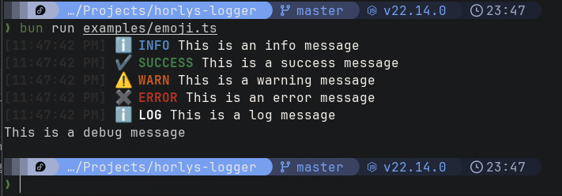
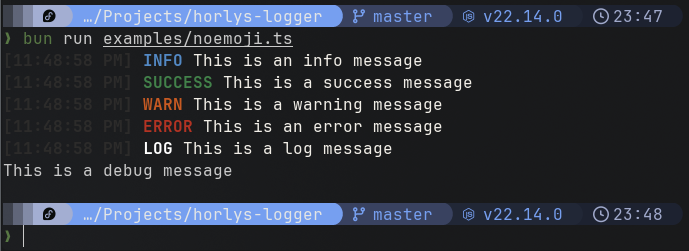

# Logger
This library provides a simple logging utility for javascript projects. It supports various log levels and can be easily integrated into existing projects.
It's part of the “Horlys” suite, a project designed to bring together libraries useful in the development of javascript projects.

## Installation
`npm install @horlys/logger`

## Usage
```
import Logger from '@horlys/logger';

// Without emoji
const logger = new Logger();

// With emoji
const loggerWithEmoji = new Logger({ emoji: true });

// Info
logger.info('This is an info message');
// Success
logger.success('This is a success message');
// Warning
logger.warn('This is a warning message');
// Error
logger.error('This is an error message');
// Log
logger.log('This is a log message');
// Debug
logger.debug('This is a debug message');
```

### Preview
#### With emoji

#### Without emoji


## Documentation
### Configuration
Here is the definition of the configuration object of the class :
```typescript
{
  emoji: boolean;
}
```

### Methods
Here is the definition of the methods of the class :
```typescript
{
  info(args: any[]): void;
  success(args: any[]): void;
  warn(args: any[]): void;
  error(args: any[]): void;
  log(args: any[]): void;
  debug(args: any[]): void;
}
```
